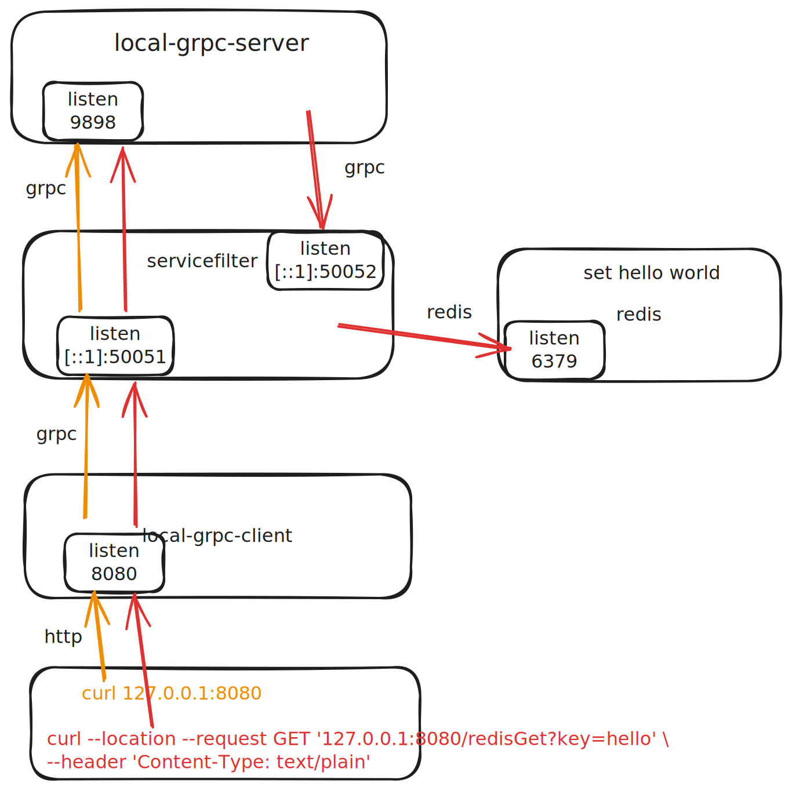
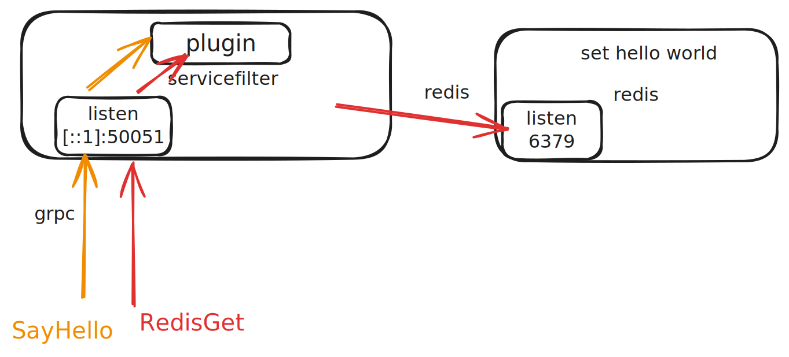

# example
servicefilter usage example, servicefilter provides two service docking methods: plugin and service.

# service


* start `local-grpc-server` [LocalGrpcServerApplication](grpc-spring/examples/local-grpc-server/src/main/java/net/devh/boot/grpc/examples/local/server/LocalGrpcServerApplication.java)

* start `local-grpc-client` [LocalGrpcClientApplication](grpc-spring/examples/local-grpc-client/src/main/java/net/devh/boot/grpc/examples/local/client/LocalGrpcClientApplication.java)

* start `servicefilter`
before starting, Execute `cargo build` in the `servicefilter-rust` directory to build `servicefilter-lib-redis`. Modify [config file](service-filter-server.yaml) `lib_load_path`.
Exec servicefilter-rust/.vscode/launch.json `servicefilter-server`, Also pay attention to the configuration of `args`.

* test
```bash
curl 127.0.0.1:8080

# The following command needs to start redis and set the value `set hello world`
curl --location --request GET '127.0.0.1:8080/redisGet?key=hello' \
--header 'Content-Type: text/plain'
```

# plugin


* start `servicefilter`
before starting, Execute `cargo build` in the `servicefilter-rust` directory to build `servicefilter-lib-redis` and `servicefilter-lib-mock-server`. Modify [config file](service-filter-local.yaml) `lib_load_path`.
Exec servicefilter-rust/.vscode/launch.json `servicefilter-local`, Also pay attention to the configuration of `args`.

* test
Debugging using grpc client, the file [proto file](docs/proto/helloworld.proto)

# Question
## grpc-spring How to optimize the addition of medadata
Now I configure the custom ClientInterceptor to GrpcClient to add metadata, but this method requires each interface to be defined once and is not friendly. The code like [ServicefilterMetadataClientInterceptor](grpc-spring/examples/local-grpc-client/src/main/java/net/devh/boot/grpc/examples/local/client/GrpcClientService.java)

Another way I thought of GrpcClient
```java
Metadata[] metadatas() default {};

@interface Metadata {
    String key();
    String value();
}
```
GrpcClientBeanPostProcessor
```java
protected List<ClientInterceptor> interceptorsFromAnnotation(final GrpcClient annotation) throws BeansException {
    final List<ClientInterceptor> list = Lists.newArrayList();
	// start
    GrpcClient.Metadata[] metadatas = annotation.metadatas();
    if(metadatas.length > 0) {

        Metadata metadata = new Metadata();
        for(GrpcClient.Metadata meta : metadatas) {
            metadata.put(Metadata.Key.of(meta.key(), Metadata.ASCII_STRING_MARSHALLER), meta.value());
        }
        ClientInterceptor headerInterceptor = MetadataUtils.newAttachHeadersInterceptor(metadata);
        list.add(headerInterceptor);
    }
	// end
    for (final Class<? extends ClientInterceptor> interceptorClass : annotation.interceptors()) {
        final ClientInterceptor clientInterceptor;
        if (this.applicationContext.getBeanNamesForType(interceptorClass).length > 0) {
            clientInterceptor = this.applicationContext.getBean(interceptorClass);
        } else {
            try {
                clientInterceptor = interceptorClass.getConstructor().newInstance();
            } catch (final Exception e) {
                throw new BeanCreationException("Failed to create interceptor instance", e);
            }
        }
        list.add(clientInterceptor);
    }
    for (final String interceptorName : annotation.interceptorNames()) {
        list.add(this.applicationContext.getBean(interceptorName, ClientInterceptor.class));
    }
    return list;
}

```
I think the best way is [ServicefilterConfig](grpc-spring/examples/local-grpc-client/src/main/java/net/devh/boot/grpc/examples/local/client/ServicefilterConfig.java)

```java
    @Bean
    GrpcChannelConfigurer servicefilterConfigurer() {
        return (builder, name) -> builder.intercept(new ClientInterceptor() {
            @Override
            public <ReqT, RespT> ClientCall<ReqT, RespT> interceptCall(MethodDescriptor<ReqT, RespT> methodDescriptor, CallOptions callOptions, Channel channel) {
                return new ForwardingClientCall.SimpleForwardingClientCall<ReqT, RespT>(channel.newCall(methodDescriptor, callOptions)) {

                    @Override
                    public void start(Listener<RespT> responseListener, Metadata headers) {
                        headers.put(X_SERVICEFILTER_SERVICE_NAME, name);
                        super.start(responseListener, headers);
                    }
                };
            }
        });
    }
```


## Why don't rust and go support plugins like c language?
## tokio runtime ffi
When I use redis async, an error will be reported "there is no reactor running, must be called from the context of a tokio 1.x runtime"
The code like servicefilter-rust/servicefilter-lib/servicefilter-lib-redis/src/redis_routing_filter.rs.bak